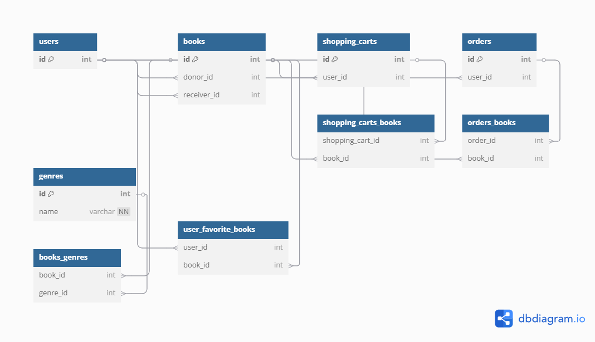

# Nest Reads

## Description
BookNest is a web application for book exchange between users. Anyone can give away a book, earn points, and use them to get other books from the community. The project supports user registration, login (including Google login), browsing and searching for books, and personalized book recommendations based on the user's preferences.


## Features
- 🔐 User authentication and authorization (email & Google login)

- 📖 Add and browse available books

- 🎯 Get personalized book recommendations

- 🪙 Earn points for each book you give away

- 📦 Spend points to request books from other users

## Technologies Used

- **Spring Boot version 3.4.1**: For building and running the application.
- **Spring Data JPA version 3.4.1**: For interacting with the database using JPA.
- **Spring Security version 3.4.1**: For implementing security features such as authentication and authorization.
- **MySQL version 8.0.33**: For the relational database management system.
- **Liquibase version 4.30.0**: For database versioning and migrations.
- **JWT version 0.12.6**: For secure token-based authentication.
- **MapStruct version 1.6.3**: For automatic mapping between entities and DTOs.
- **JUnit 5 version 5.11.4**: For writing and running tests.
- **TestContainers version 1.20.4**: For running isolated test environments with Docker containers.
- **Lombok version 1.18.36**: For reducing boilerplate code with annotations like `@Getter`, `@Setter`, `@AllArgsConstructor`, etc.

## Project's API
[View Postman Collection](https://www.postman.com/planetary-robot-110333/workspace/nest-reads-project/collection/40055606-8a491912-7ce9-4fbf-8ae5-8fde3e306b02?action=share&creator=40055606)

## DB Diagram


## Installation and Setup

### Prerequisites

- **Java 21** or higher
- **Maven** (for building the project)
- **MySQL** or another compatible database (you can adjust the configuration for another DB if needed)
- **Git** (for cloning the repository)

### Step 1: Clone the Repository

Clone the repository from GitHub:

```bash
git clone https://github.com/StoneBlood-bit/nest-reads
```
### Step 2: Configure Database
- **1.** Install and run MySQL (or another database). If you're using MySQL locally, create a new database:
```
CREATE DATABASE nest-reads
```
- **2.** Configure your database connection. In the application.properties file (located in src/main/resources), adjust the connection settings:
```
spring.datasource.url=your.url
spring.datasource.username=your.username
spring.datasource.password=your.password
```
### Step 3: Configure the `.env` file

- Create the .env file in the root directory of the project if it doesn’t already exist.
- Add the following configuration to the .env file:
```
JWT_SECRET= your secret
GOOGLE_CLIENT_ID= your client id for OAuth
GOOGLE_CLIENT_SECRET= your client secret for OAuth
```
- Ensure the `.env` file is not committed to version control by adding it to the .gitignore file:
```
# .gitignore
.env
```
### Step 4: Load the .env File
To load the .env file into your Spring Boot application, you can use the dotenv library (for example, by adding a dependency in pom.xml if needed). However, Spring Boot typically loads environment variables from the system, so you can use the variables directly with @Value annotations or in application.properties:
`jwt.secret=${JWT_SECRET}`
### Step 5: Build the project
If you have Maven installed, build the project using:
```bash
mvn clean install
```
### Step 6: Run the application
To run the application locally, use:
```bash
mvn spring-boot:run
```